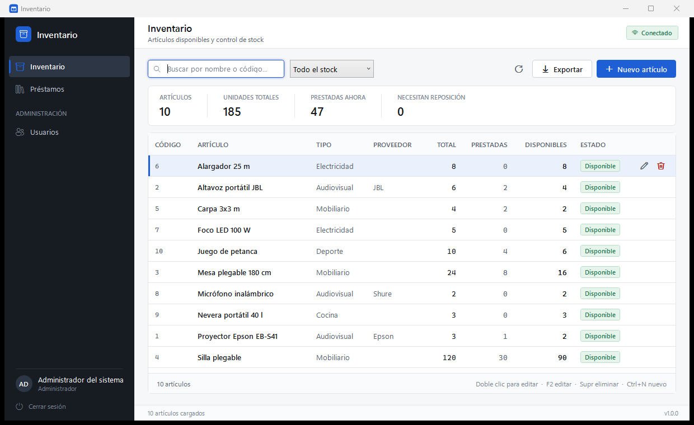
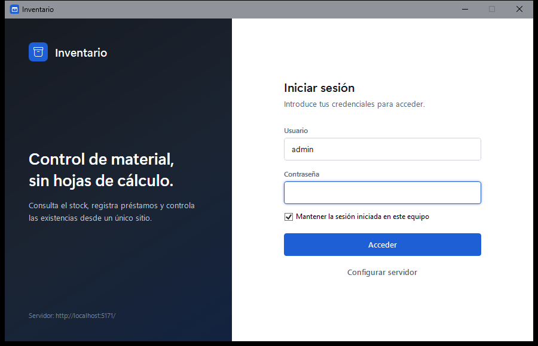
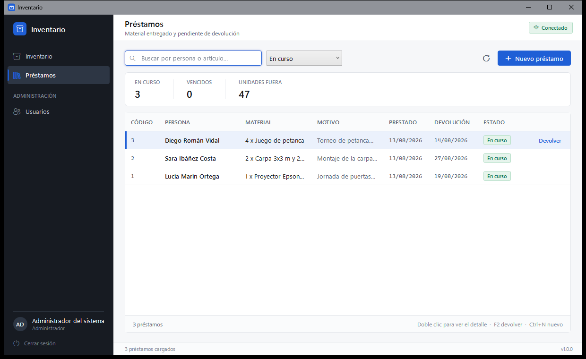
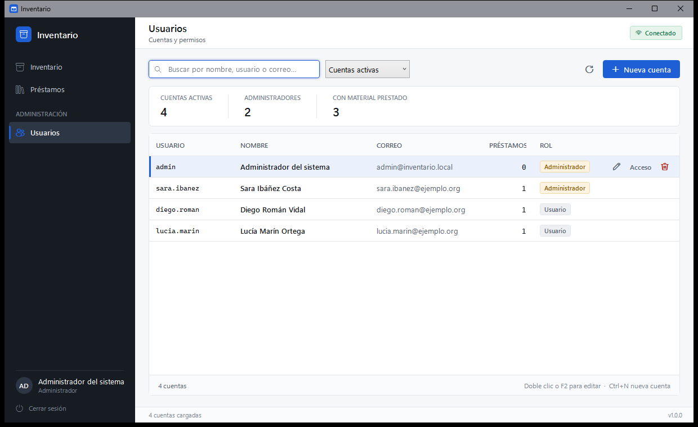

# AssetFlow Manager

Gestión de inventario de material y préstamos para una asociación: qué hay,
cuánto queda libre, quién se ha llevado qué y cuándo debería devolverlo.

Cliente de **escritorio para Windows** y cliente **Android**, sobre una API
común que es donde se toman todas las decisiones de seguridad.



## Qué hace

- **Inventario.** Alta, edición y baja de material, con búsqueda en servidor,
  filtros por estado de stock y exportación a CSV.
- **Disponibilidad calculada.** Las unidades libres se derivan de los préstamos
  vivos, no de un contador que se va restando. El total refleja lo que se posee
  y no cambia al prestar.
- **Préstamos con flujo de aprobación.** Un usuario solicita material y un
  administrador aprueba o rechaza; la devolución sigue el mismo camino. Cinco
  estados con transiciones declaradas en un único sitio. Un usuario normal sólo
  ve los suyos.
- **Reserva de unidades.** Una solicitud pendiente compromete stock aunque el
  material siga en el almacén: sin eso, dos solicitudes sobre la última unidad
  podrían aprobarse las dos.
- **Recuperación de contraseña con autorización.** Quien la olvida deja una
  solicitud desde la pantalla de acceso y un administrador la aprueba dentro de
  la aplicación, con aviso en el menú. La respuesta al solicitante es idéntica
  exista o no la cuenta — idéntica también **en tiempo**, no sólo en contenido.
  Al aprobar se asigna una contraseña provisional que **no sirve para nada
  hasta que su titular la cambia**: la sesión que abre está bloqueada para
  todo lo demás.
- **Cuentas y permisos.** Alta de personas, dos roles (administrador y usuario)
  y reinicio de contraseña, separado del resto de la edición porque tiene otras
  consecuencias.
- **Auditoría.** Accesos, decisiones sobre préstamos, cambios de rol y de
  contraseña quedan registrados con su autor y su momento, sin guardar
  direcciones IP ni ningún secreto.
- **Sesión persistente opcional**, protegida con DPAPI en el equipo del usuario.

| Acceso | Préstamos | Cuentas |
|---|---|---|
|  |  |  |

## Arquitectura

```
┌──────────────────────┐                      ┌──────────────────────┐
│  AssetFlow.Desktop   │                      │     AssetFlow        │
│        (WPF)         │                      │      (Android)       │
└──────────┬───────────┘                      └──────────┬───────────┘
           │ usa                                         │
           ▼                                             │
┌──────────────────────┐                                 │
│    AssetFlow.Core    │                                 │
│  cliente HTTP, DTOs, │                                 │
│  sesión, DPAPI       │                                 │
└──────────┬───────────┘                                 │
           │                                             │
           └───────────►  HTTPS · JWT Bearer  ◄──────────┘
                                  │
                                  ▼
                      ┌──────────────────────┐
                      │     AssetFlow.Api    │
                      │    (ASP.NET Core)    │
                      └──────────┬───────────┘
                                 │ EF Core
                                 ▼
                      ┌──────────────────────┐
                      │  SQLite / SQL Server │
                      └──────────────────────┘
```

Cuatro componentes:

- **`AssetFlow.Api`** — toda la lógica de negocio y todas las decisiones de
  seguridad. Es la única pieza en la que se confía.
- **`AssetFlow.Core`** — cliente HTTP tipado, DTOs, estado de sesión y
  almacenamiento seguro del token. No contiene reglas de negocio.
- **`AssetFlow.Desktop`** — interfaz WPF. No decide nada: pregunta y pinta.
- **`android/`** — cliente Android en Kotlin y Jetpack Compose. Mismo principio
  que el de escritorio: no decide nada.

El cliente oculta las acciones que la cuenta no puede realizar, pero eso es
comodidad de interfaz. **La API rechaza esas mismas operaciones aunque la
petición no venga del cliente.**

- [docs/architecture.md](docs/architecture.md) — cómo está montado y por qué
- [docs/decisiones-tecnicas.md](docs/decisiones-tecnicas.md) — las decisiones que no eran obvias y qué se descartó
- [docs/authorization.md](docs/authorization.md) — qué puede hacer cada rol, endpoint a endpoint
- [docs/configuration.md](docs/configuration.md) — configuración, correo y despliegue

## Tecnologías

| Componente | Tecnología |
|---|---|
| Lenguaje | C# 12, .NET 8 |
| API | ASP.NET Core Web API |
| Acceso a datos | Entity Framework Core 8 |
| Base de datos | SQLite (por defecto) o SQL Server |
| Autenticación | JWT Bearer + refresh token rotativo |
| Hash de contraseñas | BCrypt.Net-Next (factor 12) |
| Correo saliente | MailKit, despachado por una cola en segundo plano |
| Documentación de la API | Swashbuckle (OpenAPI) |
| Escritorio | WPF (`net8.0-windows`) |
| Cliente HTTP | `IHttpClientFactory` con manejador de renovación |
| Token en reposo | DPAPI (`ProtectedData`) |
| Pruebas | xUnit, FluentAssertions, `WebApplicationFactory` |
| Instalador | Inno Setup 6 |
| Android | Kotlin, Jetpack Compose, Retrofit, `EncryptedSharedPreferences` |

## Seguridad

Resumen de las garantías que ofrece el sistema. El detalle de cómo informar de
un fallo está en [SECURITY.md](SECURITY.md).

- Las contraseñas se guardan con **BCrypt** y coste configurable. El cliente
  nunca recibe la contraseña, ni su hash, ni la sal.
- **Toda la autorización ocurre en el servidor**, por rol y por propiedad del
  recurso. Cambiar el identificador de la URL no da acceso a datos ajenos.
- La política de autorización es **cerrada por defecto**: un endpoint nuevo
  nace protegido y hay que abrirlo explícitamente.
- Los tokens de acceso son de vida corta y el token de refresco **rota en cada
  uso**; reutilizar uno ya canjeado revoca toda la cadena de sesión.
- El endpoint de acceso está **limitado por origen** y las cuentas se bloquean
  temporalmente tras varios fallos seguidos.
- Los errores se devuelven en formato `ProblemDetails` **sin trazas de pila,
  SQL ni rutas del servidor**.
- El registro de actividad **redacta** contraseñas, tokens y cabeceras de
  autorización antes de escribir.
- La recuperación de contraseña **no permite averiguar qué correos están dados
  de alta**: la respuesta es idéntica exista o no la cuenta, en contenido y en
  tiempo. Una cuenta no puede pedirla más de dos veces en media hora.
- La contraseña provisional que se asigna al recuperar **es de un solo uso**:
  la sesión que abre no puede leer ni escribir nada hasta cambiarla, y no se
  puede «cambiar» por ella misma.
- **No hay ningún secreto en el repositorio.** Ver
  [docs/configuration.md](docs/configuration.md) y
  [`.env.example`](.env.example).

## Instalación

### Usuario final

1. Descarga el instalador de la [última versión](../../releases/latest).
2. Ejecútalo. No pide permisos de administrador.
3. Al abrir la aplicación por primera vez, pulsa **Configurar servidor** e
   indica la dirección de la API.

No hace falta instalar .NET: el paquete lo incluye.

> El instalador no está firmado con un certificado de firma de código, así que
> Windows SmartScreen mostrará un aviso la primera vez. Es lo esperable en
> software sin firmar; se acepta desde *Más información → Ejecutar de todas
> formas*.

### Desde el código

Requisitos: [.NET 8 SDK](https://dotnet.microsoft.com/download/dotnet/8.0).

```bash
git clone <url-del-repositorio>
cd AssetFlowManager

# 1. API. Crea la base de datos SQLite y siembra datos de ejemplo.
#    Imprime por consola la contraseña del administrador inicial.
cd src/AssetFlow.Api
dotnet run

# 2. Cliente de escritorio, en otra terminal.
cd src/AssetFlow.Desktop
dotnet run
```

Con la API en marcha, la documentación interactiva de los endpoints está en
`/swagger` (sólo en desarrollo).

La configuración necesaria para un despliegue real (clave de firma, cadena de
conexión, contraseña inicial, correo saliente) está en
[docs/configuration.md](docs/configuration.md). Hay una plantilla lista para
copiar en [`.env.example`](.env.example).

### Migraciones

La API las aplica al arrancar (`Database.MigrateAsync()`), así que clonar y
ejecutar funciona sin pasos previos. Es adecuado para el despliegue de
instancia única al que apunta este proyecto; con varias instancias arrancando a
la vez habría que sacarlas del arranque y ejecutarlas como paso previo del
despliegue.

Para aplicarlas a mano hay que indicar el contexto, porque hay un juego de
migraciones por proveedor:

```bash
dotnet tool install --global dotnet-ef

# SQLite (por defecto)
dotnet ef database update --project src/AssetFlow.Api \
  --context SqliteAssetFlowDbContext

# SQL Server
dotnet ef database update --project src/AssetFlow.Api \
  --context SqlServerAssetFlowDbContext
```

## Pruebas

```bash
dotnet test
```

**131 pruebas de integración** que levantan la API completa —con su
autenticación, autorización, limitador y manejo de errores— y hablan con ella
por HTTP. No se sustituye ninguna de esas piezas por una versión de mentira,
porque son justamente las que se quieren comprobar: un test que desactiva el
limitador para poder pasar no demuestra nada sobre el limitador.

| Área | Qué comprueba |
|---|---|
| Autenticación | 401 sin credenciales, indistinguibilidad entre usuario inexistente y contraseña incorrecta |
| Tokens | firma manipulada, formato inválido, rotación y detección de reutilización del refresco |
| Autorización | permisos por rol y escalada de privilegios |
| IDOR | acceso a fichas, préstamos e historiales ajenos cambiando el identificador |
| Asignación masiva | que `userId` en el cuerpo no permita actuar en nombre de otro |
| Flujo de préstamos | máquina de estados completa, doble aprobación, transiciones inválidas |
| Reservas | que lo pendiente descuente de lo disponible y se libere al rechazar |
| Recuperación | enumeración de cuentas por contenido **y por tiempo de respuesta**, que sólo un administrador pueda autorizar, que la contraseña provisional no sirva para nada hasta cambiarla, y que no pueda «cambiarse» por sí misma |
| Auditoría | que registre autor y momento, que sea sólo de lectura y que no contenga secretos |
| Datos sensibles | que ninguna respuesta contenga contraseñas, hashes ni sales |
| Validación | entradas fuera de rango, vacías o con formato inválido |
| Reglas de negocio | disponibilidad, sobregiro, devolución doble, integridad referencial |
| Fuerza bruta | que el martilleo del acceso acabe rechazado |

## Generar el paquete distribuible

```powershell
pwsh tools/publicar.ps1
```

Ejecuta las pruebas, publica la aplicación autocontenida para `win-x64` y
compila el instalador. Se detiene si las pruebas fallan.

## Estado y limitaciones conocidas

- La aplicación de escritorio es **solo para Windows** (WPF y DPAPI).
- La recuperación de contraseña **exige que haya un administrador disponible**
  para autorizarla. No hay forma automática de recuperar una cuenta, y si la
  única cuenta de administración pierde su contraseña hay que reiniciarla
  actuando sobre la base de datos.
- **El correo es opcional** y sólo se usa para avisar al titular de que su
  contraseña ha cambiado. Sin SMTP configurado la aplicación funciona igual y
  ese aviso se escribe en el registro. Ver
  [docs/configuration.md](docs/configuration.md#correo-saliente).
- El instalador (`installer/Inventario.iss`) está escrito y `tools/publicar.ps1`
  lo invoca, pero **nunca se ha compilado**: requiere Inno Setup 6 instalado.
  El guion detecta su ausencia, avisa y termina dejando la carpeta publicada
  lista.
- El paquete publicado ocupa unos 147 MB porque incluye el runtime de .NET. No
  se aplica recorte: WPF resuelve estilos y plantillas por reflexión y el
  recortador produce binarios que fallan en tiempo de ejecución.
- El directorio `AndroidApp/` contiene un cliente Android que **queda fuera del
  alcance de esta versión** y no se ha revisado.

## Licencia

[MIT](LICENSE). Es una licencia permisiva y corta, adecuada para un proyecto
que se publica como muestra de trabajo: permite que cualquiera lo lea, lo use
y lo adapte, sin obligar a que los trabajos derivados adopten la misma
licencia, y limita la responsabilidad de quien lo escribió.
